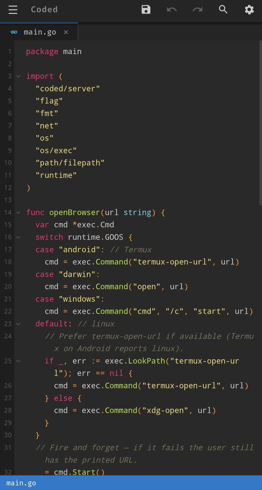

<p align="center">
  
</p>
<p align="center"><strong>A full code editor. Right in your browser.</strong></p>

<p align="center">
  Edit anywhere, even on a phone with Termux. Fast, offline, and dependency-free.
</p>

<p align="center">
  <a href="#quick-start">Quick start</a> ·
  <a href="#features">Features</a> ·
  <a href="#keyboard-shortcuts">Shortcuts</a> ·
  <a href="#architecture">Architecture</a>
</p>

<p align="center">
  
  
</p>

<p align="center">
  
</p>

## Quick start

```sh
go run .                 # serve the current directory
go run . --dir ~/myapp   # serve a specific directory
go run . --port 8080     # pin a port (default: first free port)
```

Open the printed URL in your browser. That's it — the entire UI (fonts included) is
embedded in the binary.

```sh
go build .               # produce a standalone `coded` binary
```

## Features

### Editing
- Syntax highlighting for 25+ languages (Go, JS/TS, Python, Rust, C/C++, HTML, CSS, ...)
- **Autocomplete** — context-aware, per language:
  - HTML: tag/attribute completion, Emmet-style expansion (`di` → `<div></div>`), `!` → HTML5 boilerplate
  - CSS: property and value completion inside blocks
  - Go: stdlib completion after `pkg.` (e.g. `fmt.Pr` → `Println()`)
  - All languages: keywords + identifiers from your open files (strings/comments excluded)
  - Snippets: `fori`, `iferr`, `tryc`, ... expand to full constructs
- Custom undo/redo, auto-indent, bracket auto-close and matching, code folding
- Find & replace (per file and folder-wide), Quick Open (`Ctrl+P`), Go to Line (`Ctrl+G`)

### File management
- File tree with create, rename, delete, **cut / copy / paste** (context menu or `Ctrl+C/X/V`)
- Multi-select mode for bulk copy / move / delete
- Detects external file changes and warns before overwriting

### Preview
- **Run button** for HTML files — serves your project at `/preview/` like a real web host,
  so relative CSS/JS/image imports just work
- Image files open as previews directly in the editor

### Customization (Settings)
- 8 themes: Monokai, Dracula, One Dark Pro, Catppuccin (4 flavors), Pastel on Dark
- 6 bundled coding fonts: Fira Code (default), JetBrains Mono, Cascadia Code, Geist Mono,
  Source Code Pro, IBM Plex Mono — all served offline
- Adjustable font size and line height, hidden-file toggle

## Keyboard shortcuts

| Shortcut | Action |
|---|---|
| `Ctrl+S` | Save |
| `Ctrl+P` | Quick Open |
| `Ctrl+G` | Go to line |
| `Ctrl+F` / `Ctrl+H` | Find / Replace |
| `Ctrl+Shift+F` | Find in folder |
| `Ctrl+Z` / `Ctrl+Shift+Z` | Undo / Redo |
| `Ctrl+C/X/V` (tree row selected) | Copy / Cut / Paste file |
| `Tab` / `Enter` (popup open) | Accept completion |
| `Alt+Z` | Toggle word wrap |
| `Ctrl+Shift+[` / `]` | Fold / unfold |

## Architecture

```
main.go            CLI flags, listener setup
embed.go           //go:embed static  → whole UI ships inside the binary
server/            HTTP API (net/http, no frameworks)
  /api/tree        directory listing        /api/file      read/write (text)
  /api/raw         raw bytes + MIME         /api/search    folder search
  /api/create      new file/folder          /api/rename    rename/move
  /api/copy        recursive copy           /api/delete    delete
  /preview/*       static server rooted at your project dir
static/            frontend (vanilla JS, no build step)
  js/editor.js         contenteditable editor core
  js/autocomplete.js   context-aware suggestion engine
  js/acdata.js         Go stdlib + Python builtin data (generated locally)
  js/tokenize.js       Prism adapter for highlighting
```

- **No frontend build step** — plain ES6 scripts, edit and reload
- **Path safety** — every API call resolves through a root-jail (`resolveWithinRoot`);
  `..` escapes are rejected
- **Limits** — files over 10 MB are refused; binary files open as previews, not text

## Tests

```sh
go test ./server/               # Go API tests
node static/js/editor_test.js   # editor logic tests
```

## Why

Editing code on a phone usually means a laggy Electron port or a app with ads.
Coded is a single static binary you run next to your code: drawer sidebar, touch-sized
targets, selection-safe modals, and everything works offline.
